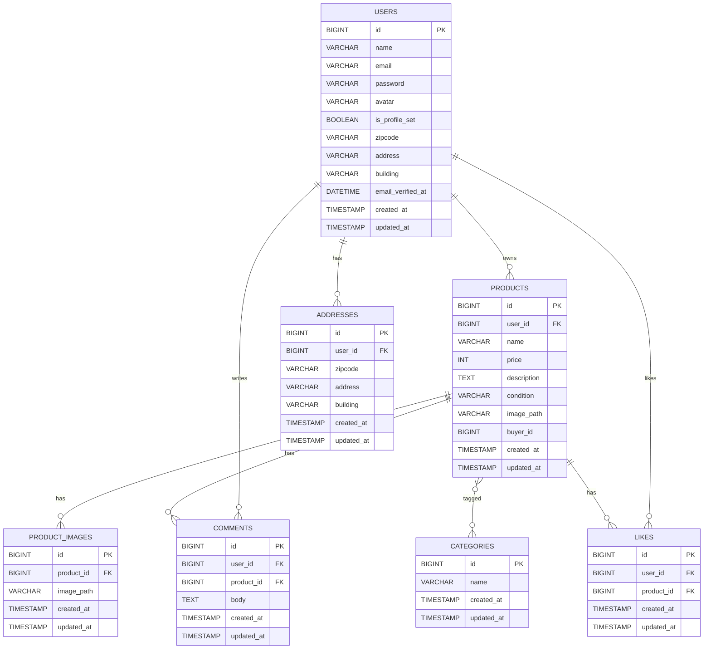

# coachtech-flema

## 環境構築
### Dockerビルド
    GitHab      : git clone git@github.com:kiki1226/coachtech-flema.git
    起動          : docker-compose up -d
    php             : docker-compose exec php bash
    停止            : docker compose down
    
### Laravel環境構築
    インストール    :  php composer install
    APP_KEY 生成    :  php artisan key:generate
    ストレージ公開    :  php artisan storage:link
    .env 用意       :cp .env.example .env 
    マイグレーション  : php artisan migrate
    シーディング     :  php artisan migrate --seed

### テストコード
    Feature / Unit テスト（PHPUnit）: php artisan test
    Feature一部指定                 : php artisan test --filter=*****
    Dusk                          : php artisan dusk
    Dusk一部指定                    : php artisan dusk --filter=*****

## URL（開発環境）
    トップページ：http://localhost/
    ユーザー登録：http://localhost/register
    phpMyAdmin：http://localhost:8080/
    メール確認：http://localhost:8025/

## 使用技術
    PHP 8.2.x
    Laravel 10.x
    MySQL 8.0.x
    nginx 1.22.x
    jQuery 3.7.x

## ER図

